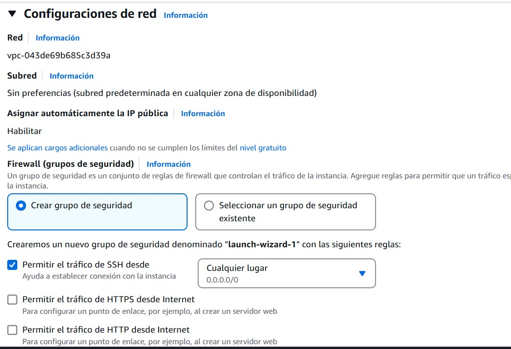
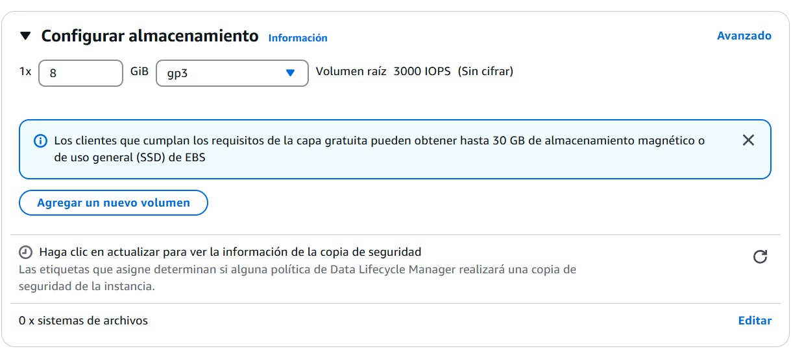
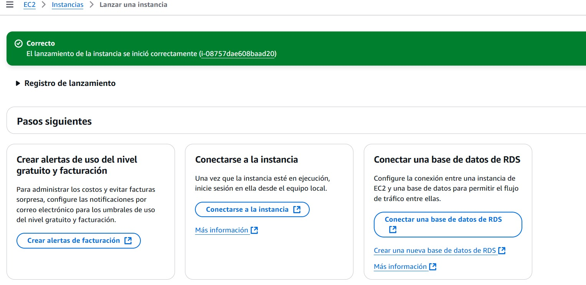
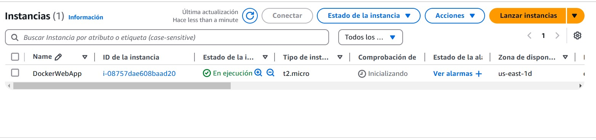
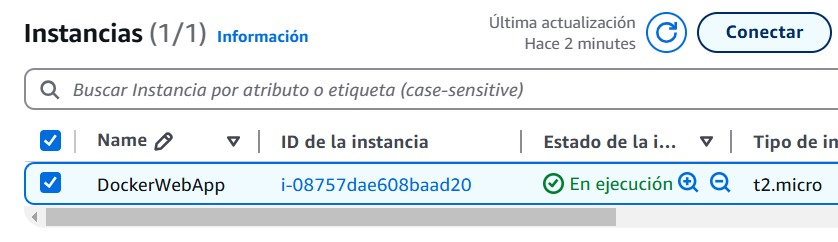
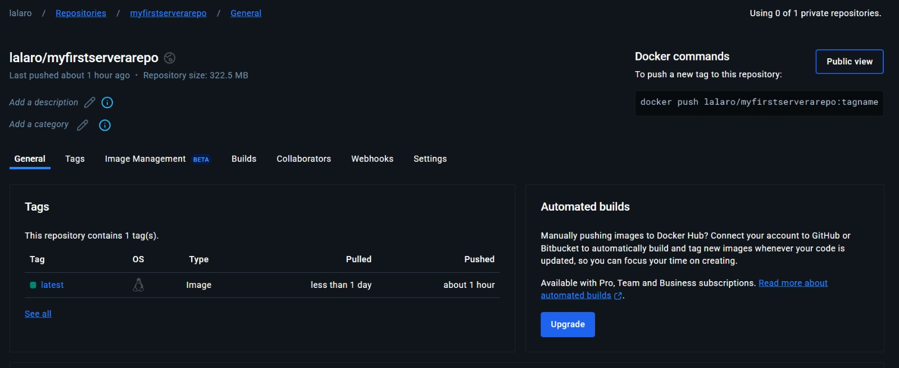

# Lab4 AREP

## Comenzando

Se debe clonar el proyecto localmente con el comando:

` git clone https://github.com/lalaro/LAB4AREP.git`

Y luego revisar las intrucciones a continuación para el manejo de soluciones del proyecto.

### Prerrequisitos

Se necesita de Maven (La versión más reciente) y Java 19, la instalación debe realizarse desde las paginas oficiales de cada programa.

### Instalación

Para Maven debe irse a https://maven.apache.org/download.cgi, descargar la versión más nueva que allá de Maven (En este caso tenemos la versión 3.9.6) y agregarse en la carpeta de Program Files, luego se hace la respectiva configuración de variables de entorno según la ubicación que tenemos para el archivo de instalación, tanto de MAVEN_HOME y de Path.
Luego revisamos que haya quedado bien configurado con el comando para Windows:

` mvn - v `
o
` mvn -version `

Para Java debe irse a https://www.oracle.com/java/technologies/downloads/?er=221886, descargar la versión 19 de Java y agregarse en la carpeta de Program Files, luego se hace la respectiva configuración de variables de entorno según la ubicación que tenemos para el archivo de instalación, tanto de JAVA_HOME y de Path.
Luego revisamos que haya quedado bien configurado con el comando para Windows:

` java -version `

Si no tenemos la versión solicitada podemos hacer lo siguiente, para el caso de Windows:

Ir al Windows PowerShell y ejecutar como administrador los siguientes codigos:

` [System.Environment]::SetEnvironmentVariable("JAVA_HOME", "C:\Program Files\Java\jdk-19.0.2", [System.EnvironmentVariableTarget]::Machine) `

Revisar las rutas de la máquina

`  $env:JAVA_HOME = "C:\Program Files\Java\jdk-19.0.2" `

`  $env:Path = "C:\Program Files\Java\jdk-19.0.2\bin;" + $env:Path `

`  echo $env:JAVA_HOME `

`  javac -version `

`  java -version `

Así se debe ver:

## Solución del lab

El desarrollo del Laboratorio es el siguiente:

Como arquitectura tenemos:

Explicación de arquitectura:

Este diagrama representa una arquitectura de sistema distribuido que involucra un cliente web, un servidor HTTP y un servidor backend, todos comunicándose a través de una red local. El cliente web realiza solicitudes al servidor HTTP, donde el servidor tiene manejo de rutas (API), con los controladores asignados (/square, /pi, /greeting), quien a su vez puede solicitar datos JSON al servidor backend. Además, el servidor HTTP sirve archivos estáticos (HTML, CSS, JS, PNG, JPEG) directamente al cliente.
En el diagrama se establece el puerto 35000 utilizado para la comunicación y la especificación de la ruta GET. El Local Server indica que todos los componentes residen en el mismo entorno local.

Desarrollo del lab:

Para la tarea usted debe construir una aplicación web y desplegarla en AWS usando EC2 y Docker. Para la implementación debe utilizar su framework (NO UTILIZAR SPRING), debe mejorar su framework para hacerlo concurrente y que se pueda apagar de manera elegante.

Entregables:
El código del proyecto en un repositorio de GITHUB
Un README que explique un resumen del proyecto, ls arquitectura, el diseño de clases y que muestre cómo generar las imágenes para desplegarlo. Además que muestre imágenes de cómo quedó desplegado cuando hicieron las pruebas.
Video con los despliegues funcionando.

Retomando lo que se realizó anteriormente:

` java -version `

Ya no es necesario copiar las dependencias porque ya se realiza desde el pom.xml
` mvn dependency:copy-dependencies `
` java -cp "target/classes;target/dependency/*" edu.escuelaing.app.AppSvr.server.WebApplication `

Para probar las clases que usan las anotaciones de forma independiente se puede:

` java -cp "target/classes;target/dependency/*" edu.escuelaing.app.AppSvr.server.WebApplication edu.escuelaing.appAppSvr.controller.GreetingController ` o ` java -cp "target/classes;target/dependency/*" edu.escuelaing.app.AppSvr.server.WebApplication edu.escuelaing.appAppSvr.controller.MathController `

Para probar todo el funcionamiento podemos traer las rutas del WebApplication, HttpServer, GreetingController y MathController.
http://localhost:35000/greeting?name=Laura

http://localhost:35000/greeting

http://localhost:35000/pi

http://localhost:35000/square?n=88

http://localhost:35000/index.html

http://localhost:35000/app/pi

http://localhost:35000/app/e

http://localhost:35000/hello

El resumen en nuestra consola de nuestras busquedas se verá así:

Para un apagado elegante se verá así:

Y de forma concurrente se tiene:

Antes:

Después:

Dockerizado y despliegue en AWS:

Configuración basica de AWS:

Paso 1:

Paso 2:

Paso 3:

Paso 4:

Paso 5:

Paso 6:

Paso 7:

Paso 8:

Paso 9:

Paso 10:

Paso 11:

Paso 12:

Paso 13:

Paso 14:

Paso 15:

Paso 16:

Paso 17:

Paso 18:

Paso 19:

Configuración basica de Docker:

El trabajó final de la implementación se verá así:

Video resumen [Video de Dockerizado y despliegue en AWS](https://youtu.be/OsjT7THiUjQ).

## Ejecutando las pruebas

Podemos Abrir en terminal el proyecto y ejecutar las pruebas desde el PowerShell, en el caso de Windows. Y ejecutamos el comando:

` mvn test `

O de igual forma en el ID que deseemos.

Así se vera:

### Desglose en pruebas de extremo a extremo

1. testGreetingWithParameter

Qué prueba: Verifica que la ruta /greeting con el parámetro name=Lala devuelva "Hola Lala".
Por qué la prueba: Asegura que el servidor maneja correctamente los parámetros en la solicitud y personaliza el saludo según el nombre proporcionado.

2. testPiEndpoint

Qué prueba: Comprueba que la ruta /pi devuelve una respuesta con el código "200 OK" y el valor de π (3.141592653589793).
Por qué la prueba: Garantiza que el servidor responde correctamente a la solicitud y devuelve un valor matemático predefinido.

3. testNotFoundRoute

Qué prueba: Verifica que al acceder a una ruta inexistente (/notfound), el servidor responda con "404 Not Found".
Por qué la prueba: Asegura que el servidor maneja adecuadamente rutas inválidas y proporciona un error claro cuando no se encuentra el recurso solicitado.

4. testGreetingEndpoint

Qué prueba: Verifica que la ruta /greeting sin parámetros devuelva "Hola World" con un estado "200 OK".
Por qué la prueba: Asegura que el servidor tiene un valor predeterminado para el parámetro name cuando no se proporciona en la solicitud.

5. testSquareEndpoint

Qué prueba: Comprueba que la ruta /square con el parámetro n=100 devuelva "10000".
Por qué la prueba: Verifica que el servidor realice correctamente la operación de elevar un número al cuadrado.

6. testSquareInvalidInput

Qué prueba: Verifica que la ruta /square?n=abc devuelva un mensaje de error "Invalid input: 'n' must be an integer".
Por qué la prueba: Asegura que el servidor maneja correctamente valores no numéricos y proporciona una respuesta adecuada en lugar de generar un fallo inesperado.

7. testSimulatedRequest

Qué prueba: Comprueba nuevamente que la ruta /pi responde con "200 OK" y el valor de π (3.141592653589793).
Por qué la prueba: Es una validación adicional de que la simulación de solicitudes funciona correctamente y devuelve respuestas esperadas.

8. testMissingRequiredParam

Qué prueba: Verifica que la ruta /square sin el parámetro n devuelve un mensaje de error.
Por qué la prueba: Asegura que el servidor maneja correctamente la falta de parámetros obligatorios y responde con un mensaje de error en lugar de fallar silenciosamente.

9. testExecuteServiceWithNumber

Qué prueba: Comprueba que la ruta /square con n=5 devuelve "25".
Por qué la prueba: Verifica que el cálculo del cuadrado se realice correctamente con diferentes valores de entrada.

10. testRegisteredServicesExist

Qué prueba: Confirma que las rutas /greeting y /square están registradas en el servidor.
Por qué la prueba: Asegura que los servicios esperados existen en la aplicación y pueden manejar solicitudes.

11. testEmptyQueryString

Qué prueba: Este test verifica que cuando se recibe una cadena de consulta vacía, el servidor no encuentre valores para los parámetros y devuelva null para todos los parámetros solicitados.  
Por qué la prueba: Asegura que el servidor maneje correctamente las solicitudes sin parámetros en la cadena de consulta. Si no se manejan correctamente, podría causar errores o resultados inesperados.

12. testDuplicateParameters

Qué prueba: Este test verifica que si un parámetro de consulta aparece varias veces, como name=John&name=Alice, el servidor debe devolver el último valor de ese parámetro (Alice).  
Por qué la prueba: Es fundamental para garantizar que el servidor maneje adecuadamente los parámetros duplicados. Si el servidor no lo hace bien, podría generar resultados incorrectos.

13. testSingleParameter

Qué prueba: Este test verifica que, cuando se recibe un solo parámetro de consulta, como name=John, el servidor devuelva el valor correcto de ese parámetro.
Por qué la prueba: Es una prueba básica para asegurar que el servidor maneja correctamente los parámetros simples en la cadena de consulta. Si falla, podría indicar un problema con el manejo de parámetros.

14. testSpecialCharactersInParameters

Qué prueba: Este test verifica que los parámetros de consulta que contienen caracteres especiales, como espacios o caracteres codificados (por ejemplo, %20), sean procesados correctamente.
Por qué la prueba: Es crucial asegurarse de que el servidor pueda manejar caracteres especiales en los parámetros de consulta. Un error en esta prueba podría llevar a que los parámetros no sean interpretados correctamente, afectando la funcionalidad.

15. testMultipleParameters

Qué prueba: Este test verifica que el servidor pueda manejar correctamente múltiples parámetros en la cadena de consulta y devolver los valores esperados.
Por qué la prueba: Verifica que el servidor maneje correctamente solicitudes con múltiples parámetros, lo cual es común en muchas aplicaciones. Si falla, podría indicar que el servidor no procesa correctamente las consultas complejas.

16. testNullQueryString

Qué prueba: Este test verifica que, cuando se recibe una cadena de consulta nula (null), el servidor no genere errores y devuelva null para los parámetros solicitados. 
Por qué la prueba: Esta prueba asegura que el servidor maneje adecuadamente las solicitudes con cadenas de consulta nulas. Si no se maneja correctamente, podría generar excepciones o comportamientos inesperados.

### Y pruebas de estilo de código

El propósito principal de estas pruebas es asegurar que el servidor funcione de manera estable y confiable, respondiendo correctamente a diferentes solicitudes y manejando errores de forma adecuada. Estas pruebas ayudan a prevenir problemas en producción al detectar posibles fallos desde el desarrollo.

## Despliegue

Podemos Abrir en terminal el proyecto y compilar y empaquetar el proyecto desde el PowerShell, en el caso de Windows. Y ejecutamos los comandos:

` mvn clean `

` mvn compile `

` mvn package `

O de igual forma en el ID que deseemos.

Así se vera:

## Construido con

* [Maven](https://maven.apache.org/) - Gestión de dependencias.
* [Java](https://www.java.com/es/) - Versionamiento en Java.
* [GitHub](https://docs.github.com/es) - Sistema de control de versiones distribuido.
* [IntelliJ](https://www.jetbrains.com/es-es/idea/) - Entorno de desarrollo integrado.
* [AWS](https://docs.aws.amazon.com/es_es/) - Amazon Web Services / plataforma de servicios de nube.
* [Docker](https://docs.docker.com/) - Tecnología en contenedores que permite crear y usar contenedores Linux.

## Contribuyendo

Por favor, lee [CONTRIBUTING.md](https://gist.github.com/PurpleBooth/b24679402957c63ec426) para detalles sobre nuestro código de conducta y el proceso para enviarnos solicitudes de cambios (*pull requests*).

## Versionado

Usamos [SemVer](http://semver.org/) para el versionado.

## Autores

* **Laura Valentina Rodríguez Ortegón** - *Lab4 AREP* - [Repositorio](https://github.com/lalaro/LAB4AREP.git)

## Licencia

Este proyecto está licenciado bajo la Licencia MIT - consulta el archivo [LICENSE.md](LICENSE.md) para más detalles.

## Reconocimientos

* Agradecimientos a la Escuela Colombiana de Ingeniería
* La documentación de Git Hub
* Al profesor Luis Daniel Benavides
